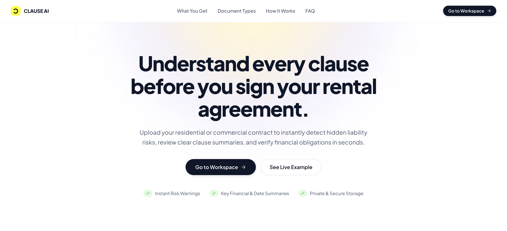
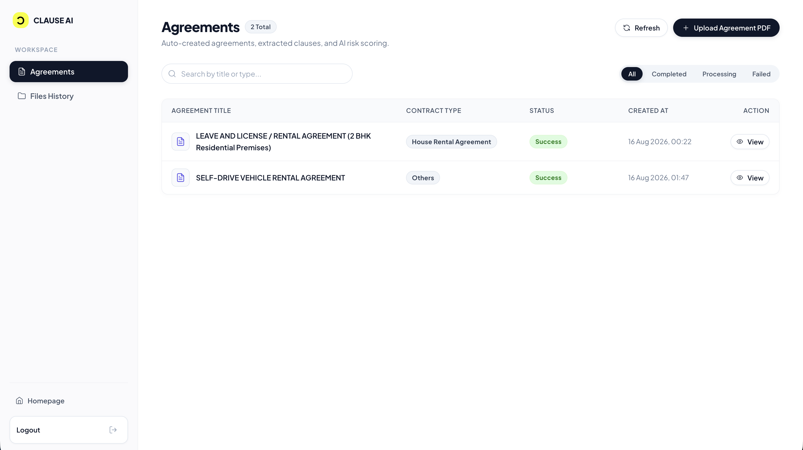
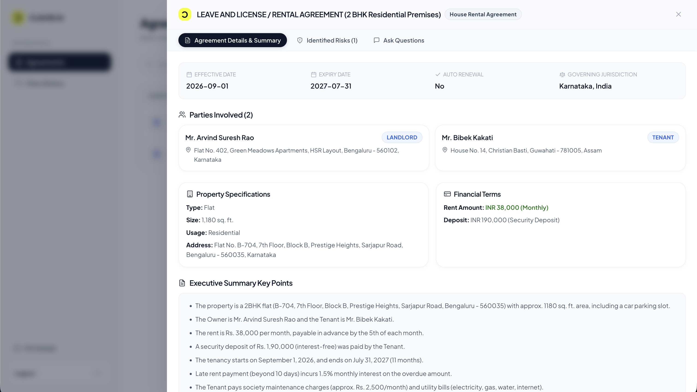
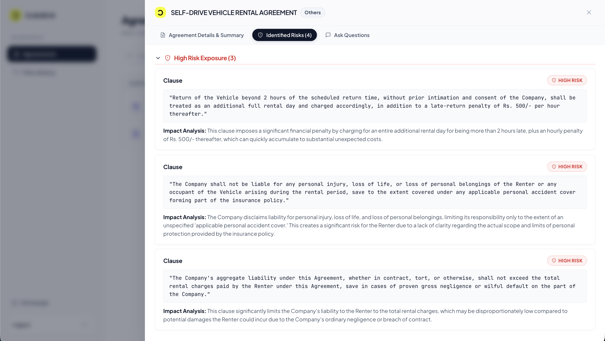
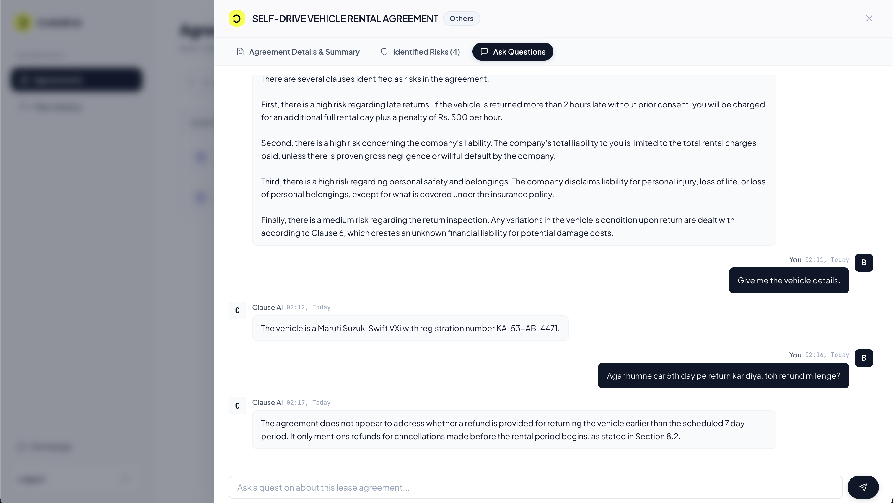

# Clause AI

Multi-agent AI platform that analyzes rental/lease agreements — extracts key terms, flags risky clauses, and lets you chat with your contract.

[](./previews/home.png)

<br>

## What It Does

- **Extraction** — pulls parties, dates, rent, deposits, and clauses from PDF/DOCX leases
- **Plain-English Summary** — turns legal jargon into simple bullet points
- **Risk Detection** — flags unfair/risky clauses with severity (LOW–CRITICAL) and exact quotes
- **Chat with your lease (RAG)** — ask questions like _"Can my landlord enter without notice?"_ and get answers grounded in your document

<br>

## Tech Stack

| Layer               | Tech                               |
| ------------------- | ---------------------------------- |
| Runtime             | Node.js, TypeScript                |
| API                 | Express.js                         |
| Agent orchestration | Mastra                             |
| AI models           | Google Gemini (chat + embeddings)  |
| Document parsing    | LlamaIndex LiteParse               |
| Database            | PostgreSQL + pgvector, Drizzle ORM |
| Queue               | Redis + BullMQ                     |
| Storage             | Cloudflare R2                      |
| Frontend            | React (SPA)                        |

<br>

## Architecture

Upload → job queued (BullMQ) → background worker runs agent pipeline → results saved to Postgres → user can chat with agreement via RAG.

**Agent pipeline:** Parser → Summary → Embeddings → Risk

<br>

## Agents

| Agent             | Responsibility                                                   | Key Tasks                                                                                                                                                                                                                                        |
| ----------------- | ---------------------------------------------------------------- | ------------------------------------------------------------------------------------------------------------------------------------------------------------------------------------------------------------------------------------------------ |
| **Parser Agent**  | Extracts and structures raw document content into validated JSON | Pulls title, agreement type, dates, parties, property details, payment/deposit terms. Splits document into tagged clause sections (Rent, Termination, Maintenance, etc). Cleans OCR/PDF artifacts without changing legal meaning.                |
| **Summary Agent** | Converts legal jargon into plain-English summary points          | Synthesizes obligations, liabilities, notice periods, and duties into up to 30 bullet points (≤240 chars each). Removes legalese (e.g. "indemnify", "lessor/lessee").                                                                            |
| **Risk Agent**    | Identifies legal, financial, and practical risks for the tenant  | Flags issues like unilateral cancellation, auto-renewals, unlimited indemnification, hidden fees, unfair deposit forfeiture. Assigns a risk score (0–100) and severity level (LOW/MEDIUM/HIGH/CRITICAL), with exact clause quotes and reasoning. |
| **Query Agent**   | Powers the interactive RAG chat assistant                        | Answers user questions using only retrieved sections/risks (no hallucination). Uses `fetchSectionsTool` for vector similarity search and `fetchRisksTool` for flagged risks. Maintains multi-turn conversational context.                        |

<br>

## Workflows

### 1. Agreement Processing Pipeline

| Step | Stage           | What Happens                                                            |
| ---- | --------------- | ----------------------------------------------------------------------- |
| 1    | Ingestion       | Agreement is uploaded; status set to **Processing**                     |
| 2    | Parser Agent    | Extracts entities, parties, dates, payments, and clause-level structure |
| 3    | Summary Agent   | Synthesizes a plain-language summary of key terms                       |
| 4    | Embedding Stage | Converts sections into vectors for semantic search                      |
| 5    | Risk Agent      | Scores and classifies risky clauses                                     |
| 6    | Health Check    | Pipeline outcome is evaluated                                           |
| 6(a) | ↳ On success    | Status set to **Success** — agreement ready for Q&A                     |
| 6(b) | ↳ On exception  | Status set to **Failed** — error reason recorded                        |

Each stage runs as a discrete, idempotent agent step with intermediate state persisted to the data layer — supporting observability, retries, and fault isolation across the pipeline.

### 2. Retrieval-Augmented Generation (RAG) Q&A Flow

| Step | Stage               | What Happens                                                                                                                                                                       |
| ---- | ------------------- | ---------------------------------------------------------------------------------------------------------------------------------------------------------------------------------- |
| 1    | User Query          | User asks a natural-language question about their agreement                                                                                                                        |
| 2    | Immediate Response  | User message is saved and a query ID is returned right away — the request does **not** block                                                                                       |
| 3    | Async Processing    | Query Agent runs in the background with the agreement's basic details (metadata, parties, payments) in its system prompt, plus the last N chat messages for conversational context |
| 4    | Self-Assessment     | Agent first checks if it can answer directly from those basic details, without calling any tool                                                                                    |
| 5    | Tool Selection      | If the question needs clause/section-level detail or risk information, the agent selects the relevant tool(s)                                                                      |
| 5(a) | ↳ Sections Tool     | Generates a query embedding, runs semantic search, and returns the most relevant sections within a max token budget                                                                |
| 5(b) | ↳ Risks Tool        | Returns pre-identified risks directly from storage — no embedding step involved                                                                                                    |
| 6    | Grounded Generation | Agent analyzes whatever information it has (basic details and/or tool results) and generates a response constrained to that evidence                                               |
| 7    | Result Check        | Outcome of generation is evaluated                                                                                                                                                 |
| 7(a) | ↳ Answer found      | Response saved; polling returns **Success** with the answer                                                                                                                        |
| 7(b) | ↳ No answer         | Polling returns **Failed** with an error reason                                                                                                                                    |
| 8    | Client Polling      | Client polls the query ID at a set interval until status changes from **Processing** to **Success**/**Failed**                                                                     |

The agent only invokes tools when the question genuinely requires them, keeping simple questions fast and reserving semantic search for clause-level queries. This constrains generation strictly to retrieved evidence, minimizing hallucination and preserving traceability from answer back to source clause. Running the Query Agent asynchronously keeps the API responsive even while the AI is still "thinking."

<br>

## Local Development

### 1. Clone & Install

```bash
git clone https://github.com/bibekkakati/clause.ai.git
cd clause.ai
npm install
```

### 2. Environment Variables

Create a `.env` file in both `apps/api` and `apps/web` using their respective `.env.example` templates.

- **Backend (`apps/api/.env`)**: Requires Postgres, Redis, S3 (Cloudflare R2), and Google Gemini API key.
- **Frontend (`apps/web/.env`)**: Requires `VITE_API_URL` pointing to the backend.

### 3. Database Setup (Backend)

Navigate to `apps/api` and run migrations:

```bash
cd apps/api
npm run generate-schema
npm run migrate-schema
```

### 4. Run Locally

**Start Backend**:

```bash
cd apps/api
npm run dev
```

**Start Frontend**:

```bash
cd apps/web
npm run dev
```

<hr>
<br>

### Dashboard View

[](./previews/dashboard.png)
<br>

### Agreements View

[](./previews/agreements-view.png)
<br>

### Risks View

[](./previews/risks-view.png)
<br>

### Chat View

[](./previews/chat-view.png)
